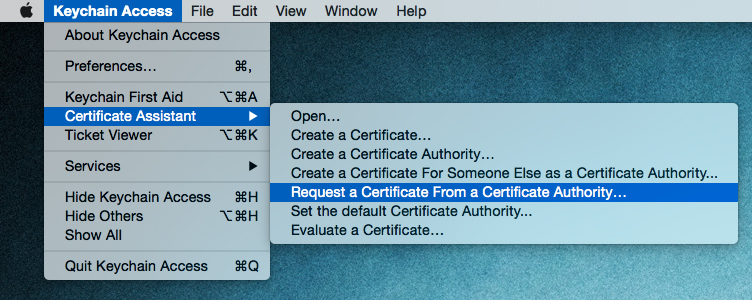
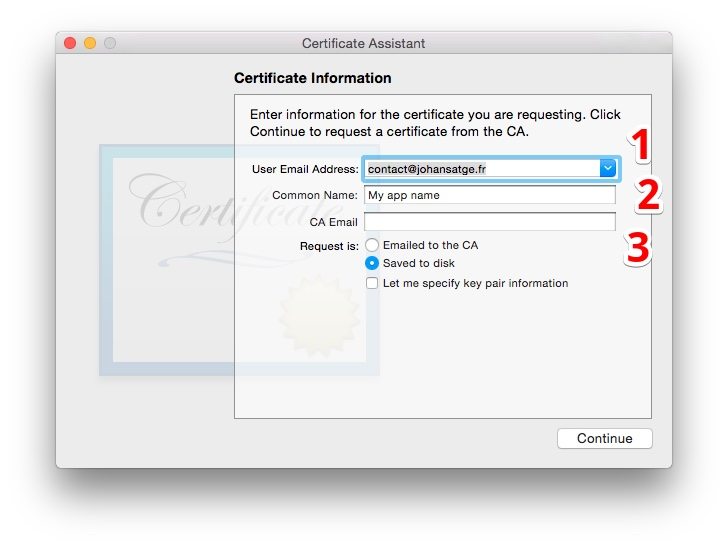
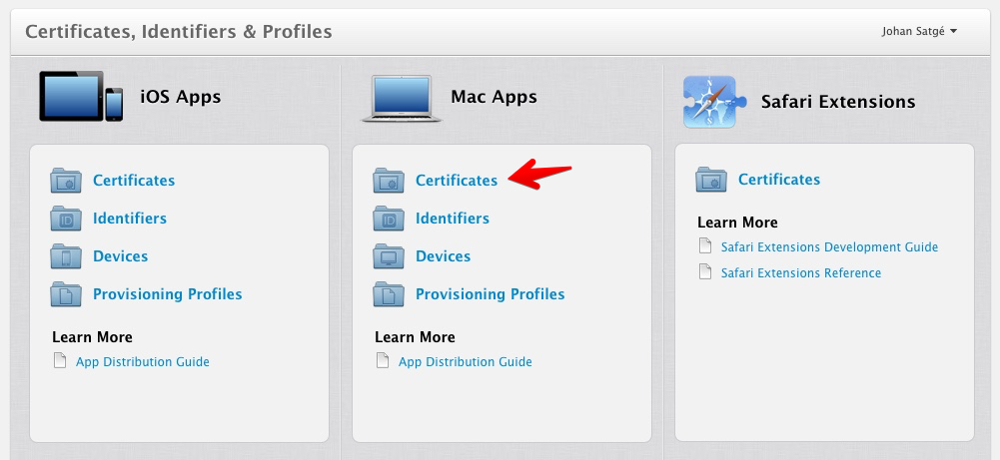
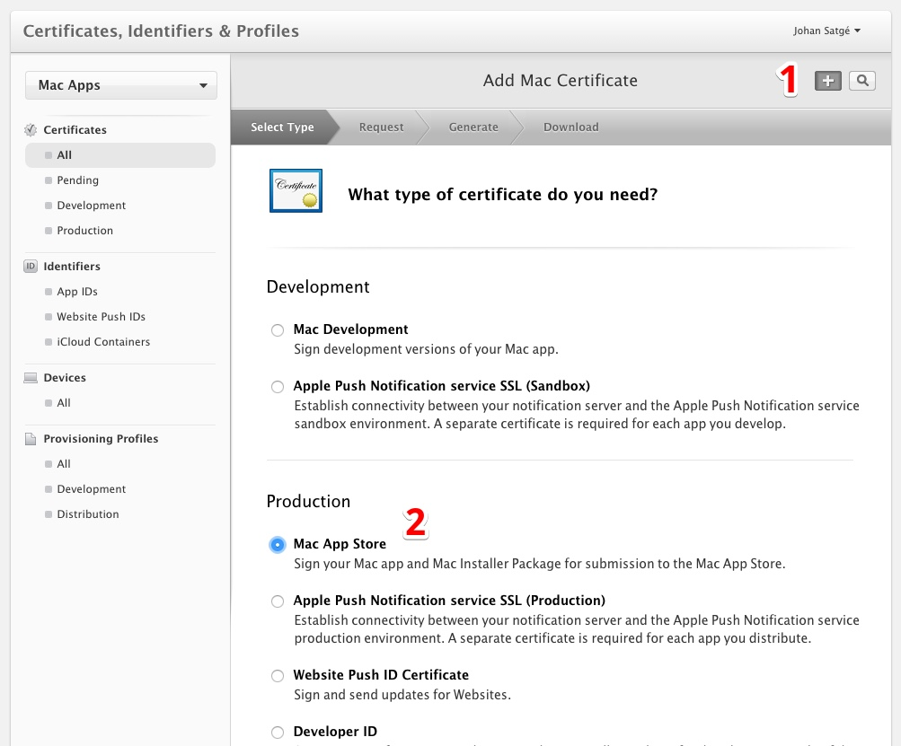
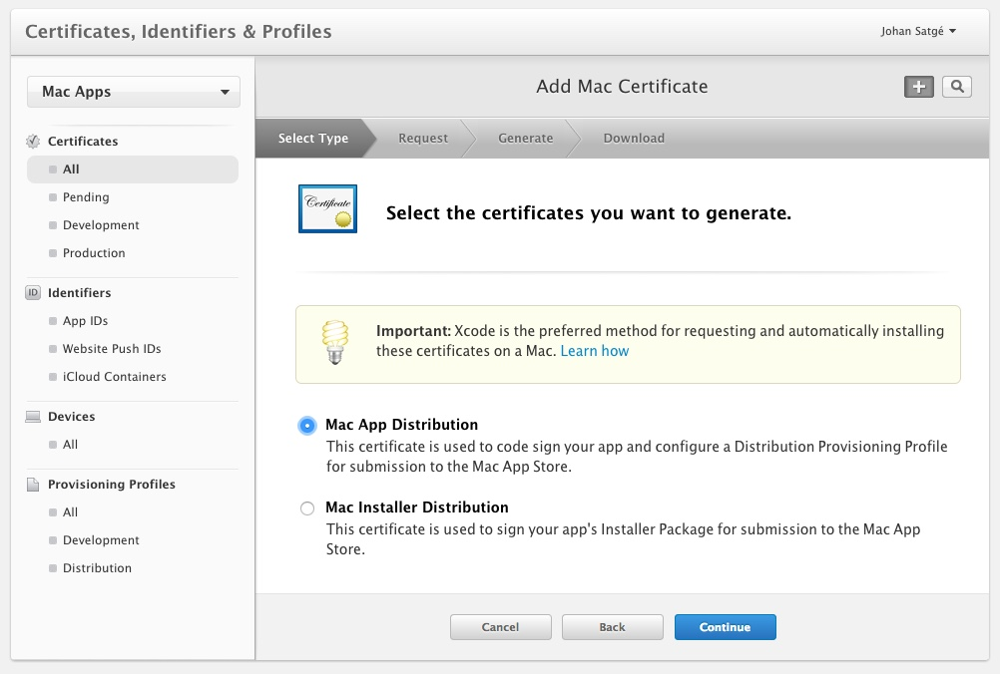
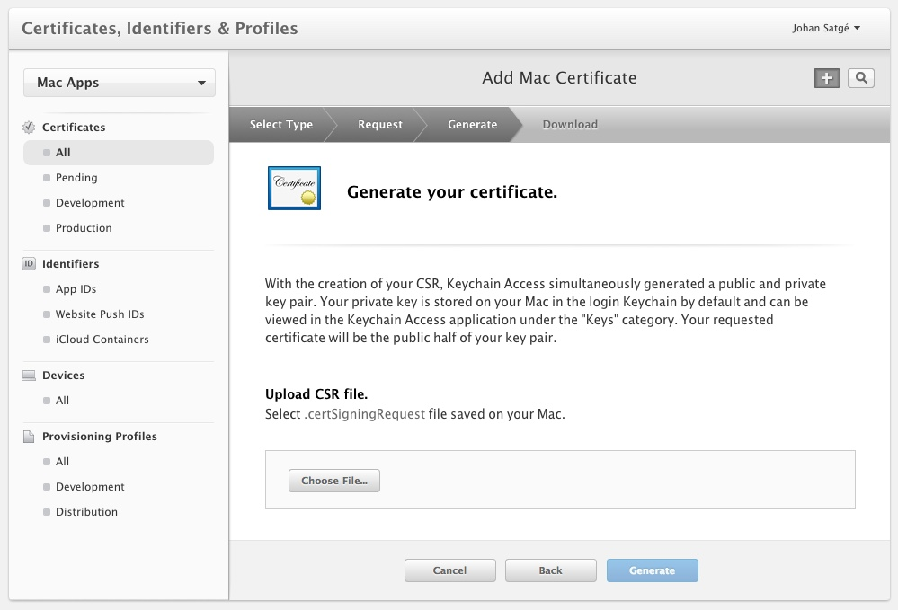
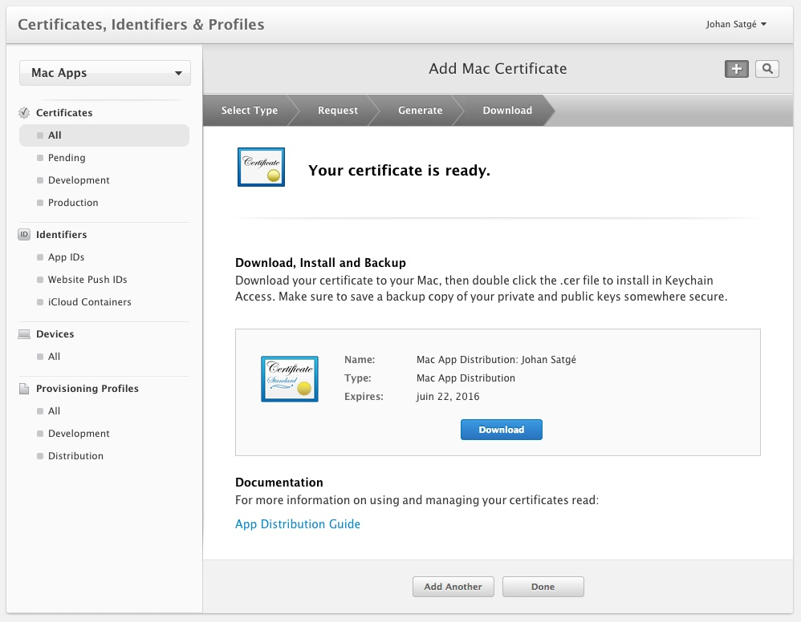
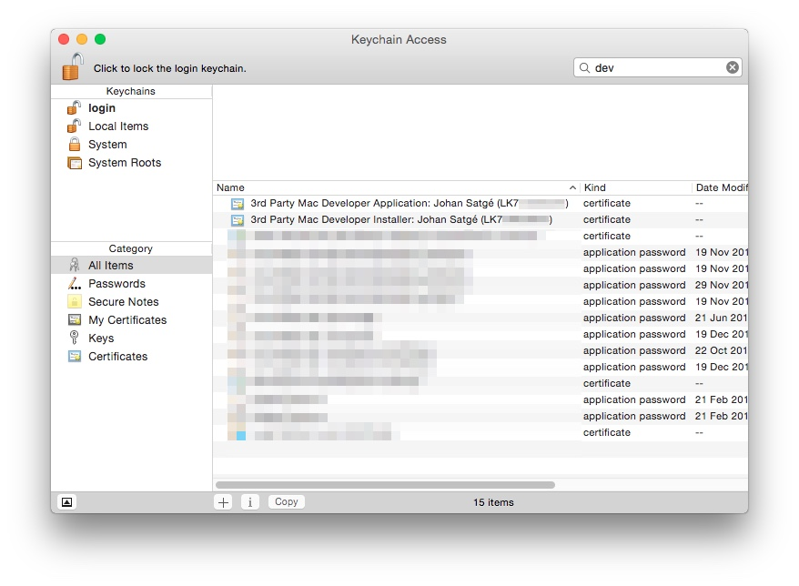

# Requesting certificates to sign your app

*This guide assumes you have an active developer account. If this is not the case, you can visit the [Apple Developer Program](https://developer.apple.com/programs/) page, and click on Enroll. Applying costs $100 per year.*

Apps on the Mac App Store are signed. A few words about it ([source](https://developer.apple.com/library/mac/documentation/Security/Conceptual/CodeSigningGuide/Introduction/Introduction.html)):

> Code signing is a security technology, used in OS X, that allows you to certify that an app was created by you.
> Once an app is signed, the system can detect any change to the app—whether the change is introduced accidentally or by malicious code.

To sign your app, you will need to have two certificates installed on your machine.

* A **Mac App Distribution** certificate - used to sign the `.app` file
* A **Mac Installer Distribution** certificate - used to sign the `.pkg` file that will be uploaded to the MAS

### Preparing the request

To request your certificates you need a `.certSigningRequest` file.

Open `/Applications/Utilities/Keychain Access.app`; in the app menu, and select *Request a Certificate From A Certificate Authority...*:

Fill the needed informations in the assistant:

1. Your email address
2. The name of the certificate
3. The *CA Email* field tells it is required, but you have to leave it blank

Save the file on the disk. Its name is `CertificateSigningRequest.certSigningRequest`.

### Generating the certificates from the Apple Member Center

Login to the [Member Center](https://developer.apple.com/membercenter), and go to the *Certificates, Identifiers & Profiles* page, which looks like this:

In the *Mac Apps > Certificates* page, click on the **+** button to add a new *Mac App Store certificate*:

Then, select *Mac App Distribution*:

Upload your `CertificateSigningRequest.certSigningRequest` file, when asked:

Finally, download the generated certificate on your machine:

Then, you have to renew those steps, by selecting *Mac Installer Distribution* instead of *Mac App Distribution*, on the concerned step.

### Installing the certificates

When both certificates have been downloaded, you have to import them in **Keychain Access**, by double-clicking on them.

The installed certificates look like this:

Save the string in parenthesis (beginning with `LK7` on the capture).

When signing the app, we will refer to it as the **identity**.
